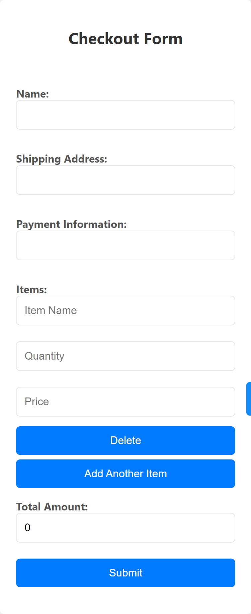

<p align="center">
  
</p>

# MERN Stack Checkout Form

This project demonstrates a simple checkout form built using the MERN stack (MongoDB, Express, React, Node.js). The application allows users to enter their details, add items to their order, and submit the form. The order data is then stored in a MongoDB database.

## Table of Contents

- [MERN Stack Checkout Form](#mern-stack-checkout-form)
  - [Table of Contents](#table-of-contents)
  - [Features](#features)
  - [Technologies Used](#technologies-used)
  - [Installation](#installation)
  - [Run the Application](#run-the-application)
  - [Run the Application](#run-the-application-1)
  - [Usage](#usage)
  - [API Endpoints](#api-endpoints)
  - [Project Structure](#project-structure)
  - [Optional Enhancements](#optional-enhancements)
  - [Future Improvements](#future-improvements)
  - [Contributing](#contributing)
  - [License](#license)

## Features

- **Frontend**:

  - A React component for the checkout form with input fields for user's name, shipping address, payment information, and order items.
  - Basic validation to ensure all fields are filled out correctly.
  - Dynamic item management (add, update, delete items).
  - Calculation of the total order amount.

- **Backend**:

  - An Express server with RESTful API endpoints to handle CRUD operations for orders.
  - MongoDB database connection to store order details.
  - Data validation and error handling on the server side.

- **Integration**:

  - Full integration between the React frontend and Express backend using Axios for HTTP requests.
  - Display of order data saved in MongoDB.

- **Optional Enhancements**:
  - Confirmation message or redirect to a "Thank You" page after successful form submission.

## Technologies Used

- **Frontend**: React, Axios
- **Backend**: Node.js, Express
- **Database**: MongoDB, Mongoose
- **Others**: Axios for API requests, HTML/CSS for basic styling

## Installation

To run this project locally, follow these steps:

1. **Clone the repository**:

   ```bash
   git clone https://github.com/your-username/checkout-form.git
   cd checkout-form
   ```

2. **Install dependencies for both frontend and backend**:

   ```bash
   # Install backend dependencies
   cd backend
   npm install

   # Install frontend dependencies
   cd ../frontend
   npm install
   ```

3. **Set up environment variables**:

   Create a `.env` file in the `backend` directory and add the following:

   ```bash
   MONGODB_URI=<Your MongoDB Connection String>
   PORT=5000
   ```

## Run the Application

To run the application, follow these steps:

```bash
# Run backend server
cd backend
npm start

# Run frontend React app
cd ../frontend
npm start
```

## Run the Application

Open your browser and navigate to [http://localhost:3000](http://localhost:3000) to view the application.

## Usage

1. Fill out the checkout form with your name, address, payment information, and add order items.
2. Click "Submit" to place the order.
3. The order will be sent to the backend and stored in the MongoDB database.
4. If an order is successfully placed, a confirmation message will be displayed, or you will be redirected to a "Thank You" page.

## API Endpoints

- **POST** `/api/orders`: Create a new order.
- **GET** `/api/orders`: Retrieve all orders.
- **PUT** `/api/orders/:id`: Update an existing order by ID.
- **DELETE** `/api/orders/:id`: Delete an order by ID.

## Project Structure

```bash
checkout-form/
│
├── backend/                     # Backend codebase
│   ├── controllers/             # Controllers for handling requests
│   ├── models/                  # Mongoose models for MongoDB
│   ├── routes/                  # Express route definitions
│   ├── app.js                   # Express server setup
│   └── .env                     # Environment variables
│
├── frontend/                    # Frontend codebase
│   ├── src/                     # React source files
│   │   ├── components/          # React components
│   │   ├── App.js               # Main React component
│   │   └── index.js             # Entry point for React
│   └── public/                  # Public files for React
│
└── README.md                    # Project documentation

```

## Optional Enhancements

- Display a confirmation message or redirect the user to a "Thank You" page after a successful order submission.
- Implement more robust validation for payment information.
- Add error handling and user notifications for various error cases (e.g., network issues, server errors).

## Future Improvements

- Add authentication and user management.
- Integrate a payment gateway (e.g., Stripe) for real payments.
- Implement a more sophisticated UI/UX design with a CSS framework or library like Tailwind CSS.

## Contributing

Contributions are welcome! Please fork the repository and submit a pull request for any improvements or bug fixes.

## License

This project is licensed under the MIT License - see the [LICENSE](LICENSE) file for details.
